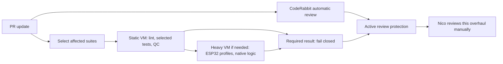

# CI operations

PRs keep two stable required quality contexts: **Quality / Static Checks** and
**Zephyr / Firmware Build**. The legacy **agent-gate** remains required until the
native approval migration below passes. Builds and tests stay on disposable
homelab VMs; routing and artifact promotion use hosted runners. The firmware
job retains the deployed controller identity (`firmware`, `Zephyr / Firmware Build`).
It performs final accounting in the same VM when heavy work is selected, or on a
hosted runner when no heavy verification is required.



| Change | Static VM | Heavy VM |
| --- | --- | --- |
| Markdown / PlantUML | Lint, local links / diagram envelopes, QC | None |
| Host DSP tests or tools | Lint, ASan + UBSan host tests, QC | None |
| Native logic tests | Lint, QC | ASan + UBSan native ztests only |
| Firmware / toolchain / quality workflow | Lint, tooling and host tests, QC | Three pristine ESP32 profiles + native ztests |
| Agent gate | Lint, gate unit tests, QC | None |
| Weekly schedule / full manual run | Every suite | Every pristine build and native test |

Static lint always validates Actions with pinned actionlint and both CI shell
scripts with pinned ShellCheck. Documentation checks validate local Markdown
links and heading anchors plus PlantUML start/end envelopes; they do **not** render
PlantUML or claim complete diagram syntax validation. QC is always evaluated.
Native and host sanitizers improve software fault detection; simulated execution
and a QC score are not hardware or medical-device validation.

## Prepared environments

Static jobs reuse `/opt/stethoscope-ci` only when Python 3.12.10, installed package
state and both hash-locked requirements match the preparation manifest. Otherwise
they install the checked-out pins. Heavy jobs validate `/opt/zephyr-workspace`
against the Zephyr/module revisions, packages, compiler and Espressif blob hashes;
missing or changed state runs canonical setup. Every selected build stays pristine.
Compiler caching and static/heavy overlap remain deferred pending measurements on
the two-core host.

The host setup and rollback procedure remains in HomelabServer's
`scripts/ci-runner/STETHOSCOPE.md`. These are read-only base images for disposable
guests, not persistent writable runners or authorization for public forks.

## Evidence and publication

Each executing VM retains commit/tree identity, run/attempt metadata and toolchain
pins. Host/native tests produce JUnit; native logs and firmware logs, RAM/ROM
reports, configuration, ELF/map and manifest are retained for 14 days. These
artifacts are diagnostics, not release approval. Firmware binaries live for
3 days. Static failure prevents heavy work and publication.

Integration push builds retain `verified-firmware-<attempt>` only after all heavy
verification passes. A daily run can promote that artifact only from a successful
same-repository integration push of this workflow at the **exact current SHA**.
Promotion rechecks run identity, complete three-profile layout, clean integration
manifest, bounded archive size and every binary's SHA-256. A missing eligible
artifact triggers a pristine build; a corrupt selected artifact fails publication.
Weekly and full manual runs always rebuild. An unchanged daily run skips only
when an earlier successful daily/manual run actually retained published firmware.
Personal Cloud continues consuming `firmware-build-<attempt>`; guests receive no
cloud credentials.

## Action minutes saved

| Reduction | Why it saves work | Limit |
| --- | --- | --- |
| Native approval instead of custom gate | Removes two short gate jobs and the review-signal job after verified migration | Native approval needs eligible separate reviewer credentials |
| Native-test-only routing | Runs the native tests without three ESP32 compilations | Firmware and toolchain edits still build all profiles |
| Exact-SHA artifact promotion | Publishes already tested binaries instead of rebuilding for publication | Only complete, clean, successful integration artifacts qualify |
| Skip unchanged daily publication | Avoids starting the verification VMs again | Weekly full verification remains |
| Event-driven recovery | Exits after requesting one rerun; handles its completion in a new event | Failed verification is still rerun once |
| PR cancellation and grouped updates | Stops obsolete PR runs; groups Actions dependency PRs | Integration verification is never cancelled by newer pushes |

The planning sample measured roughly **13–14 seconds total across the two gate jobs per evaluation**, **454 seconds
for three firmware profiles**, and **32 seconds for native logic**. These are small
sample timings, not guaranteed savings. Native-only routing avoids about 7.6 VM
minutes per such run. Retiring both gate jobs avoids about 13–14 runner seconds
per evaluation, plus review-signal executions. Recovery removes the old polling
wait of up to 85 minutes. Compare actual run durations and counts after rollout.
For this public repository, standard GitHub-hosted runners have no billed Actions
minutes; homelab VM time is also separate from billed GitHub minutes. The benefit
here is less runner work, electricity and queueing, not a promised GitHub bill reduction.
See [GitHub Actions billing](https://docs.github.com/en/billing/concepts/product-billing/github-actions)
for minute and artifact-storage accounting.
The final required accounting step deliberately remains: it catches missing outputs,
skipped selected work, failed dependencies and cancellations.

## Native approval migration (after manual review and merge)

No live ruleset is changed by this PR. The migration helper is dry-run by default.
It preserves existing rules, required-check App pins and bypass actors. Use an
admin-capable `gh` login; do not commit credentials.

1. Add native protection while **keeping agent-gate required**:

   ```sh
   python Development/system/testing/ci/native_review.py prepare \
     --repo DemonicPsychoII/DigitalStethoscope --ruleset 21015545
   # Inspect the JSON, then repeat with --apply.
   ```

   This requires one approving review, dismisses stale approvals on pushes and
   requires conversation resolution. Configure CodeRabbit approval behavior if
   needed; a comment or green progress check is not an approving review.

2. Use two real probe PRs to prove native protection accepts CodeRabbit and a
   separate fallback reviewer App/account. Each must show `reviewDecision=APPROVED`
   and that reviewer's native approval on its current head. The helper rejects
   other approving reviewers, including retained older approvals so each probe isolates the tested identity. Shared
   author credentials cannot approve their own PR. Provision the fallback identity
   before proceeding; comment-only independent reviews cannot satisfy this rule.

3. Retire the custom check only after both probes pass:

   ```sh
   python Development/system/testing/ci/native_review.py finish \
     --repo DemonicPsychoII/DigitalStethoscope --ruleset 21015545 \
     --coderabbit-pr CR_PROBE_NUMBER --fallback-pr FALLBACK_PROBE_NUMBER \
     --fallback-login SEPARATE_REVIEWER_LOGIN
   # Inspect the JSON and probes, then repeat with --apply.
   ```

   The helper removes only `agent-gate` from required statuses, then sets
   `CI_NATIVE_REVIEW=true` to stop custom gate/review-signal jobs. Its first apply
   saves `artifacts/ci/native-review-before.json`; keep that snapshot externally.
   Native reviews do not enforce session markers, owner-question markers or a
   CodeRabbit-only identity. Keep unanswered owner questions draft with auto-merge
   disabled. Native mode requires approval on reverts too.

Rollback: delete `CI_NATIVE_REVIEW` to re-enable gate jobs, restore the saved
ruleset using its writable fields (`name`, `target`, `enforcement`, `conditions`,
`rules`, optional `bypass_actors`), then dispatch `agent-gate.yml` for open PRs.
Leave protection in place throughout; a temporarily blocked merge is safe.

## Failures and local checks

Post-merge recovery reruns failed jobs once and exits. Only attempts 1 and 2
participate; later manual reruns never reopen the recovery decision. A green rerun reports
recovery. Only the same allowlisted verification step failing on both attempts
proposes a revert. Setup, queued-runner, upload and unclassified failures prompt
inspection without an automatic revert. Revert PRs still obey active protection.

```sh
python Development/system/testing/ci/validation_tools.py
# Add .ci-validation-tools and the pinned Python environment to PATH.
python Development/system/testing/ci/run_ci.py static
python -m unittest discover -s Development/system/testing/ci
python -m unittest discover -s .github/agent-gate
STETHO_SANITIZERS=true python -m pytest -q Development/system/coding/bringup-zephyr/tests/host
python Development/system/testing/ci/validate_docs.py
python Development/system/testing/ci/native_tests.py
GITHUB_ACTIONS=true python Development/system/testing/ci/run_ci.py build
```

Created by GPT-6.1-Sol on behalf of Nico running in T3 Code through Codex.
