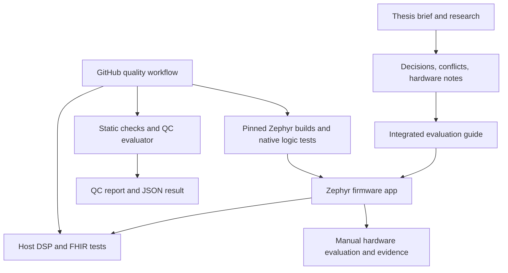

# Repository Map

Maintained paths updated: 2026-09-29. Historical inventory snapshot: 2026-09-29, before relocation.

The baseline at `dcd40e1a40954a7265cf92d5a4d8808a016c4710` tracked 121 files: 4 retained, 98 relocated, and 19 verified empty legacy files removed. These are migration counts, not a current file total; navigation and regression tests have since been added. The local SDK/workspace and old generated build remain ignored and in place. This register describes maintained ownership, not those dependencies.

## Purpose and Main Flow

The [root scope map](README.md#scope-map) separates technical definition (`engineering`), physical implementation (`hardware`), evaluation and future product software (`software`), system validation (`verification-validation`), research, thesis, project organization and infrastructure (`tools`). Unpopulated scopes are described there rather than represented by empty markers. The evaluation app remains intact; product implementation and host-tool extraction are deferred.

## Folder Map

The table describes current ownership. The [historical inventory CSV](artifacts/repository-inventory/2026-09-29/REPO-FOLDER-INVENTORY.csv) is local-only and absent in a fresh clone. It preserves its original 35,635 directory rows and old paths byte-for-byte (8,302,721 bytes); it is not a live index. Do not stage it or rescan the dependency tree to update this maintained map.

| Folder | Role and relationship |
|---|---|
| `.` | Repository root: project-wide formatting/ignore rules, GitHub workflow, root README, and this map. |
| `.git/` | Git object database and metadata; excluded from the project file register. |
| `.github/` | GitHub repository automation configuration. |
| `.github/workflows/` | GitHub Actions entry point; runs repository checks and conditionally builds firmware. |
| `engineering/` | Requirements, architecture, design, decisions and risks. Decision/contradiction registers exist; other scopes are not populated. |
| `hardware/` | Electronics, mechanics and assembly. Mixed BOM/wiring notes remain in `assembly/`; no CAD project or mechanical design is fabricated. |
| `hardware/electronics/<board>/altium/`, `releases/<rev>/` | Future real-board native project/libraries and sibling frozen fabrication/assembly/BOM/schematic outputs. No board or release exists yet. |
| `software/product/` | Status README only; no implemented product deployment. |
| `software/evaluation/firmware/` | Intact evaluation app: build inputs, `boards`, `include`, `src`, `tests`, `tools`, docs and historical `evidence`. |
| `software/evaluation/firmware/tests/host/` | Tests compile portable C DSP/FHIR and exercise local evaluator/HTTPS behavior. |
| `software/evaluation/firmware/tests/logic/` | Zephyr ztests targeting `native_sim/native/64`. |
| `software/evaluation/host/` | Navigation to still-colocated tools; extraction deferred. |
| `verification-validation/` | System plans, reference fixtures, physical/study evidence and interpreted reports; app records remain colocated. |
| `verification-validation/fixtures/qc/` | Immutable THA revision/hash metadata. |
| `verification-validation/reports/qc/2026-09-24/` | Byte-preserved historical QC report and JSON, never the live output target. |
| `research/investigations/` | Complete 27-file research bundle: 12 report/JSON pairs, runner, catalog and log. |
| `research/literature/` | Intended literature collection; unpopulated. |
| `thesis/brief/` | Three task-statement variants and preserved submission PDF. |
| `thesis/manuscript/`, `thesis/figures/`, `thesis/formal/` | Intended writing, figure and formal-submission scopes; unpopulated. |
| `project/planning/`, `project/meetings/` | Intended planning/coordination scopes; unpopulated. |
| `tools/ci/`, `tools/qc/`, `tools/toolchain/` | CI drivers/tests/locks, source QC, and environment scripts. |
| `artifacts/` | Ignored current outputs and local migration/inventory evidence; absent in fresh clones. |
| `Development/system/coding/tools/zephyrproject/` | Existing ignored installation retained in place: west modules, SDK, blobs and venv. |
| `Development/system/coding/bringup-zephyr/build/` | Old ignored build retained in place; not reused for pristine migrated builds. |
| `Development/`, `preThesis/` | Residual local directories are not maintained source. Do not bulk-delete ignored or user-only contents. |

## File-by-File Register

### Repository root and CI

| File | Label |
|---|---|
| `.clang-format` | Formatting policy used by the CI C formatter for maintained app C/H files. |
| `.gitignore` | Excludes editor state, generated builds/artifacts, Python environments, and both possible local Zephyr-workspace paths. |
| `README.md` | Human entry point and coding/noncoding scope map, including unpopulated destinations. |
| `AGENTS.md` | Sole canonical repository-wide agent routing and permission policy. |
| `CONTRIBUTING.md` | Prerequisites, environment selection and separate runnable verification gates. |
| `software/product/README.md` | Future product status, not promoted evaluation code. |
| `software/evaluation/host/README.md` | Navigation to still-colocated host tooling. |
| `verification-validation/README.md` | System plan/fixture/evidence/report navigation and provenance boundaries. |
| `REPO-MAP.md` | This index: tracked-file labels, folder roles, major flows, and restructuring boundaries. |
| `.github/workflows/quality-gates.yml` | Pull-request workflow: static checks, host tests, QC, and conditional ESP32-S3/native-simulator build gates. |

### Toolchain

| File | Label |
|---|---|
| `tools/toolchain/zephyr-env.ps1` | Validates an existing selected workspace before setting PATH, ZEPHYR_BASE and SDK variables. |
| `tools/toolchain/setup-toolchain.ps1` | Separately authorized provisioning. Shares explicit parameter, environment and existing legacy fallback selection with activation. |

### Active Zephyr application: project inputs and board

| File | Label |
|---|---|
| `software/evaluation/firmware/CMakeLists.txt` | Zephyr application build definition; explicitly compiles the firmware modules and optionally embeds a configured public CA certificate. |
| `software/evaluation/firmware/Kconfig` | App-specific options for potentiometer full scale, volatile clip capacity, optional networking, and CA file path. |
| `software/evaluation/firmware/prj.conf` | Default offline firmware configuration: drivers, shell/logging, runtime diagnostics, PSRAM, and stack settings. |
| `software/evaluation/firmware/qc.conf` | Optional stack high-water/analyzer settings for QC workload builds. |
| `software/evaluation/firmware/network.conf` | Optional Wi-Fi/TLS/SNTP/FHIR capability profile; enables capability only, not automatic connection or transmission. |
| `software/evaluation/firmware/boards/esp32s3_devkitc_procpu.overlay` | Authoritative base pin map and devicetree for I2S mic/DAC, SPI display/touch, ADC potentiometer, PWM backlight, GPIO controls, flash, and PSRAM. |
| `software/evaluation/firmware/boards/second-switch.overlay` | Optional extra speed switch pin map; explicitly outside the existing wiring confirmation. |
| `software/evaluation/firmware/README.md` | Firmware behavior, physical wiring, build profiles, shell commands, optional FHIR workflow, and limits on what software evidence proves. |
| `software/evaluation/firmware/TEST-PROTOCOL.md` | Historical component-by-component hardware protocol and prior verdicts. For the integrated firmware, use `EVAL-GUIDE.md`; do not treat old verdicts as new-image acceptance. |
| `software/evaluation/firmware/EVAL-GUIDE.md` | Current integrated evaluation plan linking requirements to host, hardware, latency, audio, BPM, and FHIR acceptance evidence. |

### Active Zephyr application: interfaces and implementation

| File | Label |
|---|---|
| `software/evaluation/firmware/include/app_types.h` | Shared component IDs, evidence grades, and input-event data types. |
| `software/evaluation/firmware/include/app_events.h` | Declares the main-owned Zephyr event queue used by input callbacks. |
| `software/evaluation/firmware/include/app_logic.h` | Platform-independent state decisions, retry policy, switch/brightness/touch helpers, and status formatting API. |
| `software/evaluation/firmware/include/peripherals.h` | Peripheral registry and probe/degrade interface. |
| `software/evaluation/firmware/include/gpio_inputs.h` | GPIO button/switch probe, interrupt startup, and LED API. |
| `software/evaluation/firmware/include/analog_backlight.h` | ADC potentiometer and PWM backlight interface. |
| `software/evaluation/firmware/include/display_touch.h` | Display/touch probe, rendering support, and counters interface. |
| `software/evaluation/firmware/include/audio_loopback.h` | I2S audio worker interface, telemetry snapshot, and volatile fixture upload API. |
| `software/evaluation/firmware/include/stetho_dsp.h` | Portable DSP, filter, BPM estimator, test-signal, and WSOLA replay types/API. |
| `software/evaluation/firmware/include/stetho_control.h` | Shared user settings, actions, and touch-to-control API. |
| `software/evaluation/firmware/include/stetho_fhir.h` | Portable FHIR ID/payload API and optional network-service interface. |
| `software/evaluation/firmware/include/status_reporting.h` | Main-owned runtime state and status-reporting API. |
| `software/evaluation/firmware/src/main.c` | Firmware entry point: probes devices, starts available features, consumes queued input, samples ADC/PWM, and reports status. |
| `software/evaluation/firmware/src/app_logic.c` | Platform-independent retry/degradation decisions, input decoding, brightness conversion, debounce, and bounded status formatting. Shared with native logic tests. |
| `software/evaluation/firmware/src/peripherals.c` | Probes each component with bounded retries and records what firmware evidence supports operational status. |
| `software/evaluation/firmware/src/gpio_inputs.c` | Button/switch interrupts, deferred debounce, event-queue delivery, and optional second-switch implementation. |
| `software/evaluation/firmware/src/analog_backlight.c` | DeviceTree-based ADC conversion and PWM backlight control. |
| `software/evaluation/firmware/src/display_touch.c` | ILI9341 dashboard/diagnostics rendering and XPT2046 event capture; owns a display worker. |
| `software/evaluation/firmware/src/audio_loopback.c` | I2S RX/TX worker, test sources, clip/fixture buffers, recovery, telemetry, and calls into the portable DSP. |
| `software/evaluation/firmware/src/stetho_dsp.c` | Portable biquad listening/analysis filters, envelope autocorrelation BPM, limiter/metrics, test signals, and WSOLA replay. Also compiled by host tests. |
| `software/evaluation/firmware/src/stetho_control.c` | Mutex-protected settings/actions and touch-dashboard command mapping shared by the UI, shell, and audio worker. |
| `software/evaluation/firmware/src/stetho_shell.c` | Serial shell for status, settings, capture/replay, fixture upload, diagnostics, clock, and optional network commands. |
| `software/evaluation/firmware/src/stetho_fhir.c` | Portable validation and JSON generation for a heart-rate FHIR Observation. Also compiled by host tests. |
| `software/evaluation/firmware/src/stetho_network.c` | Optional low-priority network worker for explicit SNTP and verified TLS FHIR PUT; builds stubs returning unsupported when networking is off. |
| `software/evaluation/firmware/src/status_reporting.c` | Combines peripheral/runtime/audio snapshots into normal or diagnostics serial logs. |

### Active Zephyr application: tests, tools, and evidence

| File | Label |
|---|---|
| `software/evaluation/firmware/tests/host/dsp_runner.c` | Small native C driver that exposes the actual DSP/FHIR code to Python tests for signal processing, replay, and payload checks. |
| `software/evaluation/firmware/tests/host/test_dsp.py` | Numerical DSP tests for filters, BPM, invalid inputs, clipping, replay pitch/duration, and FHIR payload. |
| `software/evaluation/firmware/tests/host/test_evaluate.py` | Integration tests for evaluator output and independent versus matched analysis-filter modes. |
| `software/evaluation/firmware/tests/host/test_readback.py` | Local HTTPS fixture tests for FHIR readback identity/content checks, hostname/CA verification, plaintext refusal, and redirects. |
| `software/evaluation/firmware/tests/logic/CMakeLists.txt` | Native Zephyr ztest build definition; links the test suite with `src/app_logic.c`. |
| `software/evaluation/firmware/tests/logic/prj.conf` | Minimal ztest configuration for the native logic suite. |
| `software/evaluation/firmware/tests/logic/testcase.yaml` | Twister test registration and `native_sim/native/64` platform restriction. |
| `software/evaluation/firmware/tests/logic/src/test_app_logic.c` | Ztests for retries, degraded feature selection, switch decode, formatting, brightness, touch, and driver error policy. |
| `software/evaluation/firmware/tools/evaluate.py` | Host workflow CLI: generates/evaluates WAVs, compiles the shared C runner, uploads PCM fixtures, records telemetry, and verifies HTTPS FHIR readback. |
| `software/evaluation/firmware/tools/requirements.txt` | Hash-locked Python dependencies for host evaluation and tests. |
| `software/evaluation/firmware/evidence/build-results.json` | Earlier pinned-toolchain build and native-test evidence, including Windows path/tool limitations. |
| `software/evaluation/firmware/evidence/integrated-build-results.json` | Later build-profile evidence with source hashes, toolchain versions, resource use, and artifact hashes. |
| `software/evaluation/firmware/evidence/hardware-results.schema.json` | JSON Schema for per-firmware-commit physical test records. |
| `software/evaluation/firmware/evidence/hardware-results.json` | Historical hardware verdicts by firmware commit; one record is retrospective and the later image's physical tests remain blocked pending a hardware run. |
| `software/evaluation/firmware/evidence/wiring-confirmation.json` | Records the user's confirmation of existing base wiring and explicitly limits what that statement proves. |
| `software/evaluation/firmware/evidence/host-tests.txt` | Captured host-suite result: 73 tests passed in the recorded run. Snapshot, not a live test result. |
| `software/evaluation/firmware/evidence/logic-tests.txt` | Captured native ztest run: 10 logic tests passed. Snapshot, not a live test result. |

### Quality control and CI

| File | Label |
|---|---|
| `tools/qc/README.md` | QC evaluator purpose, reproduction command, output files, and boundary between quality score and hardware/functional acceptance. |
| `tools/ci/CI-QUALITY-GATES.md` | CI contract, local parity, trigger/branch-protection notes, artifacts, and explicit hardware-validation boundary. |
| `tools/qc/qc_eval.py` | Source-level comparison evaluator against a traceable THA course baseline; writes markdown and JSON score outputs. |
| `verification-validation/reports/qc/2026-09-24/QC-EVALUATION.md` | Preserved historical scorecard. New runs write ignored `artifacts/qc/`. |
| `verification-validation/reports/qc/2026-09-24/qc-eval-results.json` | Preserved historical result; CI consumes new `artifacts/qc/qc-eval-results.json`, not this snapshot. |
| `verification-validation/fixtures/qc/tha-baseline-traceability.json` | Immutable THA revision and SHA-256 metadata; institutional source files are intentionally not copied into CI. |
| `tools/ci/firmware_changes.py` | Determines from Git diff whether a PR needs the firmware build job. |
| `tools/ci/requirements-ci.txt` | Hash-locked Python packages for CI static checks and YAML validation. |
| `tools/ci/run_ci.py` | Shared fail-fast `static`, `qc`, and `build` stages; local entry point used by workflow. |
| `tools/ci/tests/test_repository_layout.py` | Paths, workflow/trigger contracts, isolated Windows resolver/activation, QC parity/live output, registry and navigation regressions. |
| `tools/toolchain/setup_zephyr.sh` | Linux CI provisioner for the pinned Zephyr revision, SDK, modules, Python environment, and blobs. |

### Thesis brief, decisions, research, and hardware

| File | Label |
|---|---|
| `thesis/brief/Aufgabenbeschreibung.md` | General thesis task draft and work-package framing. |
| `thesis/brief/Aufgabenbeschreibung-Intern.md` | Internal detailed task version with provisional decisions, risks, and schedule; not the submission copy. |
| `thesis/brief/Aufgabenbeschreibung-Abgabe.md` | Submission-oriented task statement and workload baseline referenced by the integrated evaluation guide. |
| `thesis/brief/Aufgabenbeschreibung-Abgabe.pdf` | PDF export of the submission-oriented task statement. |
| `engineering/decisions/open-questions.md` | Decision register annotated with research findings and unresolved choices. |
| `engineering/decisions/widersprueche.md` | Explicit cross-document conflicts; currently records acoustic-chain scope and switch-numbering conflicts. |
| `research/investigations/runs.json` | Research IDs, topics, presets, and prompts consumed by `run_research.py`. |
| `research/investigations/run_research.py` | Calls the configured research proxy and writes each run's `.md` and `.json` pair. Requires `CLIPROXY_API_KEY`; running it performs external requests. |
| `research/investigations/research-log.txt` | Recorded research run log with run IDs, presets, usage, and outcomes. |
| `research/investigations/R01-murmur-metrik.md` | Human-readable findings on objective murmur metrics and filter-comparison criteria. |
| `research/investigations/R01-murmur-metrik.json` | Machine-readable run envelope and response for R01. |
| `research/investigations/R02-ground-truth.md` | Human-readable review of annotated heart-sound datasets and simulator options. |
| `research/investigations/R02-ground-truth.json` | Machine-readable run envelope and response for R02. |
| `research/investigations/R03-bpm-referenz.md` | Human-readable BPM reference methods, agreement metrics, and target accuracy. |
| `research/investigations/R03-bpm-referenz.json` | Machine-readable run envelope and response for R03. |
| `research/investigations/R04-time-stretch.md` | Human-readable time-stretch and pitch-preservation research for slowed playback. |
| `research/investigations/R04-time-stretch.json` | Machine-readable run envelope and response for R04. |
| `research/investigations/R05-hoerstudie-design.md` | Human-readable pilot listening-study design and participant/task recommendations. |
| `research/investigations/R05-hoerstudie-design.json` | Machine-readable run envelope and response for R05. |
| `research/investigations/R06-ethik-datenschutz.md` | Human-readable ethics and data-protection research for a small listening study. |
| `research/investigations/R06-ethik-datenschutz.json` | Machine-readable run envelope and response for R06. |
| `research/investigations/R07-bruststueck-mems.md` | Human-readable chestpiece-to-MEMS coupling and microphone-selection research. |
| `research/investigations/R07-bruststueck-mems.json` | Machine-readable run envelope and response for R07. |
| `research/investigations/R08-messmethode-akustik.md` | Human-readable methods for acoustic transfer-chain characterization. |
| `research/investigations/R08-messmethode-akustik.json` | Machine-readable run envelope and response for R08. |
| `research/investigations/R09-latenz.md` | Human-readable latency targets and live-monitoring context. |
| `research/investigations/R09-latenz.json` | Machine-readable run envelope and response for R09. |
| `research/investigations/R10-esp32-plattform.md` | Human-readable ESP-IDF/Zephyr platform and ESP32-S3 compute/memory comparison. |
| `research/investigations/R10-esp32-plattform.json` | Machine-readable run envelope and response for R10. |
| `research/investigations/R11-fhir-tls.md` | Human-readable FHIR heart-rate resource and embedded TLS certificate-handling research. |
| `research/investigations/R11-fhir-tls.json` | Machine-readable run envelope and response for R11. |
| `research/investigations/R12-tha-formales.md` | Human-readable THA title, registration, schedule, and submission-formality research. |
| `research/investigations/R12-tha-formales.json` | Machine-readable run envelope and response for R12. |
| `hardware/assembly/hardware.md` | Hardware bill of materials and historical wiring decisions; points readers to the maintained app pin map for current wiring. |

## Important Boundaries

- **Evaluation versus product:** the buildable firmware is `software/evaluation/firmware/`. The removed 19 empty legacy markers did not implement layers; their history remains in Git.
- **Workspace selection:** both Windows scripts use `-WorkspacePath`, then `STETHO_ZEPHYR_WORKSPACE`, then the existing legacy installation. Invalid explicit settings fail. Relocating scripts does not relocate or provision environments.
- **Entry points:** root README routes all scopes; CONTRIBUTING defines runnable checks; AGENTS is the sole global agent policy.
- **Evidence generations:** `evidence/build-results.json` and `integrated-build-results.json` are different dated records. `TEST-PROTOCOL.md` is historical; `EVAL-GUIDE.md` defines integrated acceptance. `hardware-results.json` and `wiring-confirmation.json` preserve provenance and must not be conflated with firmware runtime proof.
- **Research is paired by design:** each `R##-*.md` is the readable report and its adjacent JSON is the research run/response record. `runs.json` is the prompt catalog, not the results index; the Python runner writes to an external configured service.
- **Generated and local-only content:** the present workspace has `Development/system/coding/bringup-zephyr/build/` (ignored CMake/Zephyr output) and `Development/system/coding/tools/zephyrproject/` (ignored third-party west modules, SDK, blobs, and virtual environment). These are reproducible working assets, not repository-owned source. `.gitignore` also reserves `Development/Toolchain/zephyrproject/`, but that path is absent in the inspected workspace. `.git/` is repository metadata and is not inventoried file by file.
- **Planning/formal scopes:** intended successors are `project/planning/` and `thesis/formal/`; no records are fabricated and residual local contents are not deleted.

## Main Runtime and Verification Relationships

1. The base board overlay assigns device-tree resources. `prj.conf` supplies the offline feature set; `network.conf` and `qc.conf` are optional build profiles; Kconfig values size buffers and configure the CA input.
2. CMake links `main.c`, the peripheral/input/UI modules, the audio worker, portable DSP/control/FHIR code, shell commands, and status reporting into the Zephyr app.
3. Input callbacks debounce and enqueue events; `main.c` applies state changes. The audio worker consumes shared settings, calls `stetho_dsp.c`, and publishes a snapshot. Display and optional network workers consume those interfaces independently.
4. Host tests compile `stetho_dsp.c` and `stetho_fhir.c` with `dsp_runner.c`; Python tests check numerical behavior and evaluator/readback workflows. Native ztests compile `app_logic.c` independently of the hardware app.
5. The CI workflow runs static/QC and host checks, then provisions the pinned Zephyr workspace and performs firmware/profile/native-logic checks when relevant firmware or CI inputs change. Physical acceptance remains manual and is documented separately.
6. The thesis task and research inform evaluation decisions, but disagreements are tracked in `open-questions.md` and `widersprueche.md`; the firmware README/EVAL guide describe the current implementation and acceptance boundaries.